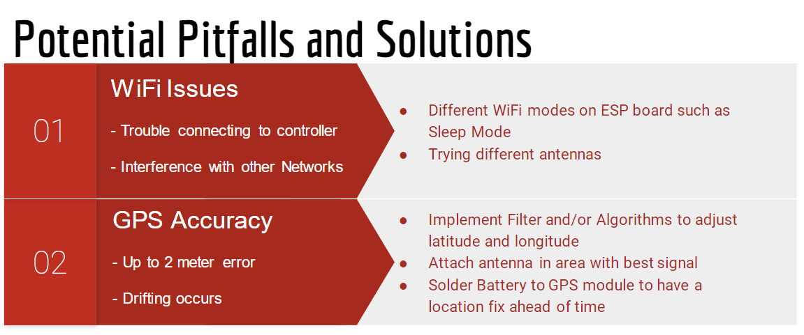

# Processor
## System requirements
- Enable vehicle-to-vehicle communication over an RF link. -> "Succeeded"
- Create a remote controller to allow for human control of lead vehicle -> "Succeeded"
- Process positional data for convoy navigation. -> "Failed"
- Permit a 1m-10m following distance between vehicles -> "Failed"
## Overview of Implementation
### Controller
- Lead vehicle hosts webpage for controller
- Can use any WiFi enabled device with a broswer to control the vehicle
- Websocket is established on connection
- Data transfer speed limited by refresh rate of device screen
### Vehicle-to-vehicle comms
- Clients act as stations and servers as access points
- Pair of vehicles that have client-server relationship
- Data transferred over TCP socket
## Potential Pitfalls

## Future Work
- Obtain accurate GPS data
    - Want consistent GPS path
    - Smoothing data
- Pass info from vehicle-to-vehicle (did not see demo)
- Give movement data to Avoidance
# Avoidance
- Not alot to note
- Might require more improvement from processor, meaning it will need to be prepared for the extra data?
## Requirements
- Pathing: Vehicle autonomously follows breadcrumbs provided by PROC team
- Obstacle Detection and Avoidance
- Power: Max of 8W for 2 hours
- Turning Speed: capable of turning at up to 50% of max velocity
- Must be less than 2kg
## Sim Conclusion
- Works
    - "Effective" sim of system
    - Meets **many** requirements
- However,
    - Needs refinement
    - Doesn't account for potholes
## Future Suggestions
- Integrate Sensor Detection and Obstacle Avoidance together.
- Refinement of Sensor functionality including LIDAR.
- Adjust Autonomous control Protocol.
- ***Integration of OAS with PROC and VEH sub-teams.***